# Lunova

> **AI-Powered Proposal Response Agent**

Lunova is an AI-powered proposal response system designed to automate and accelerate the lifecycle of incoming Requests for Proposals (RFPs) and proposal inquiries received via email. 

Lunova is initially being developed for **Lunetron**. The long-term architectural goal is to make Lunova fully configurable for other organizations by allowing each tenant to supply their own company identity, knowledge base, and email integration. However, multi-company support is **NOT** yet implemented; the current MVP is exclusively tailored and scoped for Lunetron.

---

## 1. Project Overview

Responding to technical RFPs and commercial proposals requires parsing complex requirements, searching internal organizational knowledge, formulating grounded responses, and undergoing human verification. Lunova unifies these steps into a single, cohesive workflow:

1. Ingesting incoming proposal inquiries from email.
2. Normalizing the message and extracting attachment content.
3. Performing requirement extraction and structuring via AI.
4. Retrieving relevant organizational knowledge with grounded source attribution.
5. Drafting a high-quality, cited proposal response.
6. Presenting the response to human reviewers for review, editing, and approval.
7. Dispatching the finalized response back through email.
8. Recording an immutable audit trail of all actions.

---

## 2. Current MVP Scope

The current MVP focuses strictly on a minimal, high-leverage vertical slice:

- **Target Tenant**: Lunetron only (`company_id = "lunetron"`).
- **Knowledge Base**: Lunetron internal knowledge base only.
- **Input Channel**: Email only (via normalized adapter; our own development/testing inbox initially).
- **Human-in-the-loop**: Mandatory human review before any email response is dispatched.
- **Explicit MVP Non-Goals**:
  - Multi-platform/multi-channel inputs (e.g., Slack, web forms, portal uploads) are **NOT** in MVP.
  - Multi-company onboarding UI/flows are **NOT** in MVP.
  - Redis, Celery, or distributed worker brokers are **NOT** in MVP.
  - Microservices and Kubernetes are **NOT** in MVP.
  - Public cloud deployment automation is **NOT** in MVP.

---

## 3. Architecture Overview

Lunova is built as a **Modular Monolith** rather than distributed microservices. This provides low operational overhead, rapid developer iteration, unified end-to-end typing, and zero distributed system latency while maintaining clean domain boundaries.

```mermaid

flowchart TD

subgraph group_platform["Platform Domains"]
  node_email_ingestion["Email Ingestion"]
  node_proposal_management["Proposal Management"]
  node_company_context["Company Context"]
  node_email_domain["Email Domain"]
end

subgraph group_intelligence["AI Intelligence"]
  node_intelligence_service["Intelligence Service<br/>[service.py]"]
  node_requirement_extraction["Requirement Extraction"]
  node_knowledge_retrieval["Knowledge Retrieval"]
  node_response_generation["Response Generation"]
  node_grounding_evaluation["Grounding Evaluation"]
end

subgraph group_review_delivery["Review Delivery"]
  node_review_workflow["Review Workflow"]
  node_email_dispatch["Email Dispatch"]
  node_audit_history["Audit History"]
end

subgraph group_persistence["Persistence Contracts"]
  node_proposal_contract["Proposal Contracts"]
  node_knowledge_store[("Knowledge Store")]
  node_proposal_store[("Proposal Store")]
end

node_incoming_email(("Incoming Email"))
node_human_reviewer(("Human Reviewer"))
node_llm_service["LLM Provider"]
node_embedding_service["Embedding Provider"]

node_incoming_email -->|"sends email"| node_email_ingestion
node_email_ingestion -->|"normalizes message"| node_email_domain
node_email_domain -->|"creates proposal"| node_proposal_management
node_proposal_management -->|"resolves tenant"| node_company_context
node_proposal_management -->|"submits context"| node_intelligence_service
node_intelligence_service -->|"extracts requirements"| node_requirement_extraction
node_intelligence_service -->|"retrieves sources"| node_knowledge_retrieval
node_intelligence_service -->|"generates draft"| node_response_generation
node_intelligence_service -->|"evaluates grounding"| node_grounding_evaluation
node_response_generation -.->|"requests completion"| node_llm_service
node_knowledge_retrieval -.->|"embeds queries"| node_embedding_service
node_knowledge_retrieval -->|"reads knowledge"| node_knowledge_store
node_proposal_management -->|"stores lifecycle"| node_proposal_store
node_proposal_management -->|"uses input contract"| node_proposal_contract
node_intelligence_service -->|"returns analysis"| node_proposal_contract
node_intelligence_service -->|"submits draft"| node_review_workflow
node_human_reviewer -->|"reviews draft"| node_review_workflow
node_review_workflow -->|"dispatches approval"| node_email_dispatch
node_email_dispatch -->|"sends response"| node_incoming_email
node_review_workflow -->|"records decision"| node_audit_history
node_proposal_management -->|"records lifecycle"| node_audit_history
node_audit_history -->|"persists history"| node_proposal_store

click node_email_ingestion "https://github.com/joshi-chinmay-016/lunova/tree/dev/backend/app/infrastructure/email"
click node_proposal_management "https://github.com/joshi-chinmay-016/lunova/tree/dev/backend/app/domain/proposal"
click node_company_context "https://github.com/joshi-chinmay-016/lunova/tree/dev/backend/app/domain/company"
click node_email_domain "https://github.com/joshi-chinmay-016/lunova/tree/dev/backend/app/domain/email"
click node_intelligence_service "https://github.com/joshi-chinmay-016/lunova/blob/dev/backend/intelligence/service.py"
click node_requirement_extraction "https://github.com/joshi-chinmay-016/lunova/tree/dev/backend/intelligence/extraction"
click node_knowledge_retrieval "https://github.com/joshi-chinmay-016/lunova/tree/dev/backend/intelligence/retrieval"
click node_response_generation "https://github.com/joshi-chinmay-016/lunova/tree/dev/backend/intelligence/generation"
click node_grounding_evaluation "https://github.com/joshi-chinmay-016/lunova/tree/dev/backend/intelligence/evaluation"
click node_review_workflow "https://github.com/joshi-chinmay-016/lunova/tree/dev/backend/app/domain/review"
click node_email_dispatch "https://github.com/joshi-chinmay-016/lunova/tree/dev/backend/app/infrastructure/email"
click node_audit_history "https://github.com/joshi-chinmay-016/lunova/tree/dev/backend/app/domain/audit"
click node_proposal_contract "https://github.com/joshi-chinmay-016/lunova/tree/dev/contracts"
click node_knowledge_store "https://github.com/joshi-chinmay-016/lunova/tree/dev/backend/app/infrastructure/database"
click node_proposal_store "https://github.com/joshi-chinmay-016/lunova/tree/dev/backend/app/infrastructure/database"

classDef toneNeutral fill:#f8fafc,stroke:#334155,stroke-width:1.5px,color:#0f172a
classDef toneBlue fill:#dbeafe,stroke:#2563eb,stroke-width:1.5px,color:#172554
classDef toneAmber fill:#fef3c7,stroke:#d97706,stroke-width:1.5px,color:#78350f
classDef toneMint fill:#dcfce7,stroke:#16a34a,stroke-width:1.5px,color:#14532d
classDef toneRose fill:#ffe4e6,stroke:#e11d48,stroke-width:1.5px,color:#881337
classDef toneIndigo fill:#e0e7ff,stroke:#4f46e5,stroke-width:1.5px,color:#312e81
classDef toneTeal fill:#ccfbf1,stroke:#0f766e,stroke-width:1.5px,color:#134e4a
class node_email_ingestion,node_proposal_management,node_company_context,node_email_domain,node_human_reviewer toneBlue
class node_intelligence_service,node_requirement_extraction,node_knowledge_retrieval,node_response_generation,node_grounding_evaluation toneAmber
class node_review_workflow,node_email_dispatch,node_audit_history toneMint
class node_proposal_contract,node_knowledge_store,node_proposal_store toneRose
class node_incoming_email,node_llm_service,node_embedding_service toneIndigo


```


---

## 4. Repository Structure

The monorepo separates frontend, backend, shared contracts, documentation, fixtures, and tests:

```text
lunova/
├── frontend/                    # Next.js frontend (feature-driven)
│   ├── app/                     # Next.js App Router (layout, pages)
│   ├── components/              # UI primitives and shared components
│   ├── features/                # Domain-isolated feature modules
│   │   ├── proposals/           # Proposal management & lists (Lokesh)
│   │   ├── review/              # Review, edit & approval interface (Lokesh)
│   │   ├── company/             # Company profile & tenant settings (Lokesh)
│   │   ├── knowledge/           # Document upload & knowledge viewer (Lokesh)
│   │   └── intelligence/        # Requirement insights & AI confidence UI (Shared)
│   ├── hooks/                   # Custom React hooks
│   ├── lib/                     # Client utilities
│   ├── services/                # Client API services
│   ├── types/                   # Frontend TypeScript type declarations
│   ├── public/                  # Static assets
│   ├── next.config.js           # Next.js configuration
│   ├── package.json             # Frontend dependencies
│   ├── tsconfig.json            # TypeScript configuration
│   └── README.md
│
├── backend/                     # FastAPI backend (modular monolith)
│   ├── app/
│   │   ├── api/                 # HTTP routes & dependency injection
│   │   ├── core/                # App configuration & settings
│   │   ├── domain/              # Platform domain logic (Lokesh)
│   │   │   ├── company/         # Tenant & company domain
│   │   │   ├── proposal/        # Proposal lifecycle & state machine
│   │   │   ├── email/           # Email models & parsing logic
│   │   │   ├── knowledge/       # Knowledge document domain
│   │   │   ├── review/          # Review state machine & decisions
│   │   │   └── audit/           # Audit trail & event logging
│   │   └── infrastructure/      # External integrations (Lokesh)
│   │       ├── database/        # PostgreSQL connection & migrations
│   │       ├── email/           # Gmail API adapter & normalized client
│   │       └── storage/         # Local storage adapters
│   │
│   ├── intelligence/            # AI & RAG intelligence engine (Chinmay)
│   │   ├── extraction/          # Proposal requirement extraction
│   │   ├── retrieval/           # Company-scoped vector search & RAG
│   │   ├── generation/          # Proposal response & clarification drafting
│   │   ├── evaluation/          # Grounding validation & confidence scoring
│   │   └── providers/           # LLM & Embedding provider abstractions
│   │
│   ├── tests/                   # Backend unit and domain tests
│   │   ├── domain/              # Platform tests (Lokesh)
│   │   └── intelligence/        # AI engine tests (Chinmay)
│   │
│   ├── pyproject.toml           # Backend Python dependencies & tools
│   └── README.md
│
├── contracts/                   # Shared API boundary contracts between Platform & AI
│   ├── README.md
│   ├── proposal-input.md
│   ├── proposal-analysis-result.md
│   ├── contract-versioning.md
│   └── errors.md
│
├── docs/
│   ├── architecture/            # Architectural blueprints & design specifications
│   ├── decisions/               # Architecture Decision Records (ADRs)
│   ├── requirements/            # Business & stakeholder requirements
│   └── ownership.md             # Complete team ownership & boundary matrix
│
├── fixtures/                    # Mock data for decoupled parallel development
│   ├── proposals/               # Sample proposal input payloads
│   ├── knowledge/               # Sample knowledge documents
│   └── ai-results/              # Sample AI analysis results
│
├── tests/
│   ├── integration/             # Cross-boundary integration test suites
│   └── e2e/                     # End-to-end workflow verification
│
├── scripts/                     # Developer utility and operational scripts
├── .github/                     # GitHub Actions CI workflows
├── .gitignore                   # Workspace gitignore
├── docker-compose.yml           # PostgreSQL + pgvector container
└── README.md                    # Root project documentation
```

---

## 5. Developer Ownership Boundaries

To allow both developers to build rapidly in parallel with minimal merge conflicts, ownership is strictly partitioned (see [`docs/ownership.md`](./docs/ownership.md) for full details):

| Area | Lead Developer | Responsibilities |
| :--- | :--- | :--- |
| **AI / Proposal Intelligence** | **Chinmay** | Proposal understanding, requirement extraction, requirement structuring, RAG pipeline, knowledge retrieval, source attribution, draft response generation, clarification question generation, grounding evaluation, confidence scoring, AI-related test suites (`backend/intelligence/`, `backend/tests/intelligence/`). |
| **Platform / Proposal Workflow** | **Lokesh** | Email ingestion & parsing, attachment handling, normalized email adapter, company/tenant configuration, knowledge document management, proposal lifecycle state machine, human review workflow (approve/edit/reject), email response sending, audit history, platform test suites (`frontend/`, `backend/app/`, `backend/tests/domain/`). |
| **Shared Collaboration** | **Both (Chinmay & Lokesh)** | Architecture decisions, `contracts/` definitions, `frontend/features/intelligence/`, database schemas, cross-boundary integration tests (`tests/integration/`), end-to-end tests (`tests/e2e/`), and deployment configuration. |

---

## 6. Contract-First Development

To prevent blocking either developer, communication between the **Platform Backend** and the **AI Intelligence Engine** is mediated strictly by versioned contracts in `contracts/`:

- **Platform Input Contract** (`contracts/proposal-input.md`): Defines the normalized data packet provided by the platform to the AI engine.
- **AI Output Contract** (`contracts/proposal-analysis-result.md`): Defines the structured, machine-readable result returned by the AI engine.
- **Contract Versioning** (`contracts/contract-versioning.md`): Governs semantic versioning and change management.
- **Shared Errors** (`contracts/errors.md`): Shared error taxonomy across boundaries.

By relying on mock payloads in `fixtures/`, Chinmay can develop and evaluate AI extraction and generation independently of email ingestion, and Lokesh can build the complete review workflow independently of model latency and prompt tuning.

---

## 7. Technology Direction

- **Frontend**: Next.js (App Router), TypeScript, TanStack Query, Tailwind CSS, shadcn/ui.
- **Backend**: FastAPI, Python 3.11+, Pydantic v2, SQLAlchemy 2.0, Alembic.
- **Database**: PostgreSQL 16 with `pgvector` extension.
- **AI / LLM**: Python provider abstractions for LLMs and embeddings, vector retrieval, requirement structuring, grounding checks.
- **Email**: Gmail API adapter initially (abstracted behind a provider-agnostic interface).
- **Infrastructure**: Docker and Docker Compose (Postgres + pgvector only).

---

## 8. Important Architectural Rules

All developers must adhere to these 7 architectural invariants:

1. **RULE 1: Company information must NEVER be hardcoded into AI logic.**
   *Bad*: `if company == "Lunetron": use_custom_prompt()`
   *Good*: `company_id` dynamically determines knowledge context and tenant settings.
2. **RULE 2: AI knowledge retrieval must ALWAYS be company-scoped.**
   Cross-company knowledge retrieval or shared vector search without strict `company_id` tenancy filtering is strictly prohibited.
3. **RULE 3: The AI engine must NOT depend directly on Gmail.**
   Email data and attachments must be normalized into standard contract payloads before entering the AI pipeline.
4. **RULE 4: The platform must NOT depend on AI internal implementation details.**
   The platform consumes the structured `ProposalAnalysisResult` contract and remains agnostic to prompts, embeddings, or retrieval algorithms.
5. **RULE 5: Do NOT prematurely introduce infrastructure.**
   No Redis, Celery, Kafka, or Kubernetes for the MVP. Use in-process execution and relational tables until concrete scale requirements demand distributed brokers.
6. **RULE 6: Do NOT create microservices.**
   Maintain a modular monolith. Modules communicate via clear interfaces and in-process boundaries.
7. **RULE 7: Do NOT finalize detailed contract schemas prematurely.**
   Contract fields remain conceptual until actual Lunetron requirements and representative sample proposals are evaluated.

---

## 9. Current Limitations & Future Expansion

### Current Limitations (MVP)
- Single tenant: Lunetron only.
- Ingestion channel: Email only.
- Single LLM / single provider configuration for initial development.
- Synchronous or in-process lifecycle execution without distributed queues.

### Future Expansion
- Self-service company onboarding and knowledge ingestion.
- Multi-channel ingestion (web forms, supplier portals, API endpoints, RFP platforms).
- Multi-provider email support (Microsoft Outlook / Exchange, IMAP).
- Distributed background execution via Celery / Redis when processing volume demands it.
