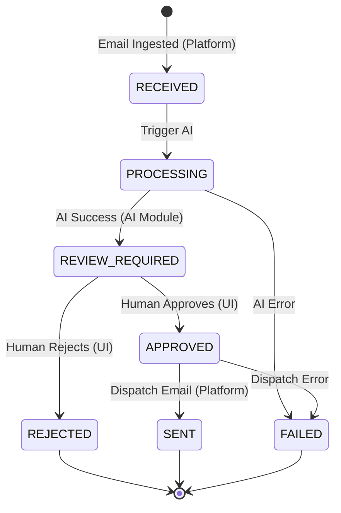

# Proposal Lifecycle

The core of the Platform is managing the state of a Proposal as it moves from initial ingestion to final dispatch.

## State Definitions

- **RECEIVED:** The system has successfully ingested the email/request, and a raw proposal record is created.
- **PROCESSING:** The AI Module is currently analyzing the requirements, querying the knowledge base, and generating a draft.
- **ANALYZED:** The AI has completed its work, but the proposal hasn't been flagged for human review yet (transitional state, might be bypassed straight to `REVIEW_REQUIRED`).
- **REVIEW_REQUIRED:** The AI draft is ready. The system is waiting for a human to review, edit, and make a decision.
- **APPROVED:** The human reviewer has approved the proposal draft.
- **REJECTED:** The human reviewer has decided the proposal should not be sent (e.g., unqualified lead, invalid request).
- **SENT:** The final approved proposal has been successfully dispatched via email.
- **FAILED:** An error occurred at any stage (e.g., AI generation failed, email dispatch failed).

## State Machine Diagram

## Lifecycle Breakdown

1. **Platform Ownership (Ingestion):** The transition to `RECEIVED` is owned entirely by the Platform's email listener.
2. **AI Ownership (Generation):** The transition from `RECEIVED` to `PROCESSING` and eventually to `REVIEW_REQUIRED` is where the AI Module does its heavy lifting. The Platform simply awaits the AI Module's result to update the state.
3. **Human Ownership (Review):** The state rests at `REVIEW_REQUIRED` until a user interacts with the UI. The user can modify the draft multiple times. The state only changes when they explicitly hit "Approve" or "Reject".
4. **Platform Ownership (Dispatch):** Once `APPROVED`, the Platform takes over again to send the email and move the state to `SENT`.
