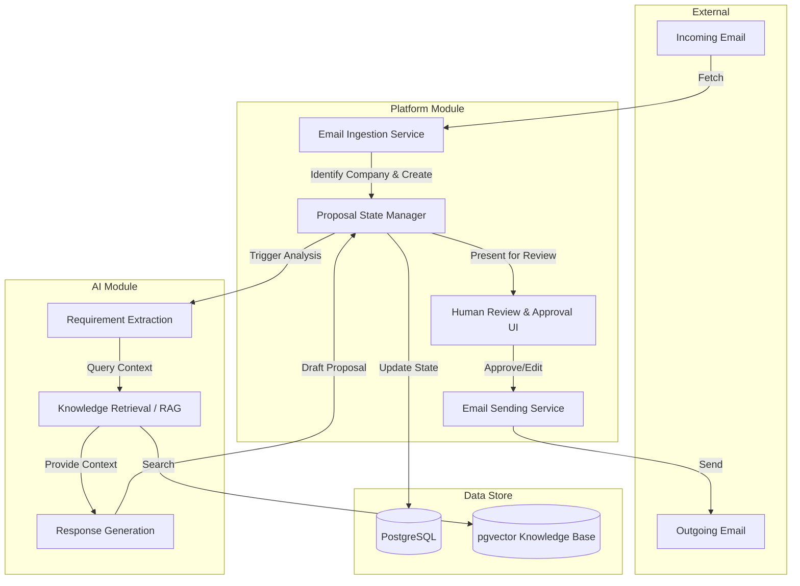

# System Overview

## Purpose of the System
The **AI Proposal Agent** is a multi-tenant platform designed to automate and assist in the proposal generation process. It ingests incoming proposal requests via email, processes the requirements using Artificial Intelligence (AI) and Retrieval-Augmented Generation (RAG) against a company's specific knowledge base, and drafts a tailored response. Human reviewers can then edit, approve, or reject the AI-generated proposal before it is sent back to the requester.

## MVP Scope
For the Minimum Viable Product (MVP), the primary focus is on a single customer: **Lunetron**. However, the underlying architecture is designed to be multi-tenant. The MVP will:
- Ingest emails via a configured email account (initially Gmail API).
- Extract and understand proposal requirements from the email and its attachments.
- Retrieve relevant context from Lunetron's knowledge base.
- Generate a grounded proposal response with source attribution.
- Provide a web-based UI for users to review, edit, and approve/reject the generated proposal.
- Send the approved proposal via email.

## Future Scope
- Onboarding multiple companies/tenants.
- Allowing each company to manage its own knowledge base and configure its own email providers (e.g., Office 365, IMAP/SMTP).
- Advanced analytics, varied attachment handling, and complex multi-step approval workflows.
- Integration with external CRM or ERP systems.

## High-Level Architecture
The system follows a **Modular Monolith** architecture to keep deployment and development simple, avoiding premature microservices. 

It is divided into two primary logical modules:
1. **Platform Module:** Handles workflow, state management, UI, persistence, and external communication (email).
2. **AI Module:** Handles requirement extraction, RAG, response generation, and evaluating confidence.

### Technology Stack
- **Frontend:** Next.js, TypeScript, TanStack Query, Tailwind CSS, shadcn/ui.
- **Backend:** FastAPI, Python, Pydantic, SQLAlchemy, Alembic.
- **Database:** PostgreSQL with `pgvector` for both relational data and vector embeddings.

## End-to-End Workflow & Architecture Diagram

### Flow Breakdown:
1. **Email Ingestion:** The Platform fetches new emails and identifies the target Company.
2. **Proposal Creation:** A new Proposal record is created in the database.
3. **AI Processing:** The Platform passes the raw data to the AI Module.
4. **Retrieval & Generation:** The AI Module queries the company's knowledge base and generates a response.
5. **Human Review:** The Platform updates the proposal state and alerts the user. The user reviews the draft via the UI.
6. **Dispatch:** Upon approval, the Platform sends the finalized response via email and logs the action.
